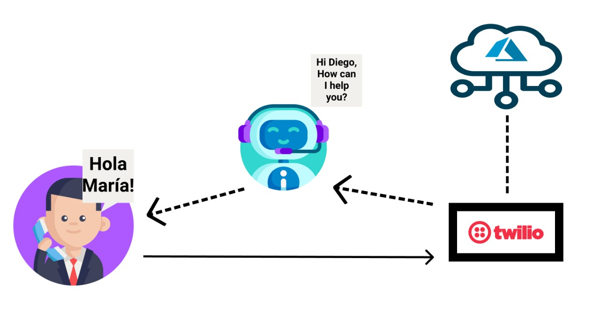

# ¡Hola María!

¡Hola María! is a bot specialized in education and our aim is to help elementary and high school students with doubts related to different topics of the student environment. Having as the main feature to provide access by phone, the student will be able to interact with ¡Hola María! by dialing a phone number, at the moment that the person dials the phone, our bot will answer by asking about the doubt you have by consulting the information through various official information sites.

# The team!
We are a multidisciplinary team with the same purpose, to make a change with our knowledge using different Microsoft technologies. Our team is integrated by engineers from Mexico, Bolivia, and Canada, being part of the Microsoft Learn Students Ambassadors program. We consider ourselves to be people who love learning from everything and everyone, it is the main reason why we are always looking for different solutions to problems that there are in our countries

- <strong>Garfia Acevedo Erik</strong>: Escuela Superior de Cómputo, Computer Systems Engineering, 8th semester. 3 years - I am a Computer Systems Engineering Student at ESCOM from IPN, Mexico. I like to share the knowledge and experiences I have acquired in the professional and social fields. I like to learn about different programming areas, I am focused on software development, both webs, and mobile. 

- <strong>Florida Román Carla Marcela</strong>: Universidad Mayor de San Simón, Systems Engineering, 10th semester. 6 years -Leader in the community "Pyladies Cochabamba," and I was awarded the prestigious Grace Hopper Celebration scholarship 2017 and 2020. Cisco Networking Academy instructor. and Researcher in an AI project.

- <strong>Paz Gómez Fernando Daniel</strong> Escuela Superior de Cómputo, Computer Systems Engineering, 8th semester. 3 years - I am a student of Computer Systems Engineering at ESCOM, IPN, Mexico. I like to be attentive to new technologies, acquire knowledge from courses, to be practical as participating in events, and can develop my skills.

- <strong>Antony Diaz</strong> - Pursuing a B.S. in Math at the University of Montreal. He is an innovator and an entrepreneur who seeks to use Artificial Intelligence as a good for society. He has won a multitude of awards and distinctions from a variety of institutions, ministries, and embassies, including (but not limited to) Hydro Quebec and the Order of Engineers of Quebec.
 
 

# Target Audience or Market

Our public is all the children students of primary and secondary level mainly since it will be with telephone call resources, the only requirement is that the geographical area has such coverage service.

## Users

Leonardo, a 9-year-old boy, in 4th grade of elementary school, home-based mode due to the current pandemic, there is no contact with his teachers, and there is no initiative from them to contact or provide education to children, Leonardo decides to continue learning in a self-taught way, but he has many doubts and does not know where to turn, he has no internet service, this is how the assistant of ¡Hola Maria, manages to provide support through a phone call, solving the doubts on the subject that he has.

 

# How it works:

Hello Maria is available every day. When a student calls the bot that is connected in Twilio, the server connected in the Azure cloud makes a call to the knowledge API in which it processes the message of the interlocutor, transforms it from speech to text, and does the search in the Web. Once the desired result is found, the bot transforms the text into speech to respond to the student.

# Core Technologies

 <h3 style="text-align:center; font-weight:bold; ">Microsoft Azure</h3> 
Microsoft Azure, commonly referred to as Azure, is a cloud computing service created by Microsoft for building, testing, deploying, and managing applications and services through Microsoft-managed data centers. It provides software as a service (SaaS), platform as a service (PaaS) and infrastructure as a service (IaaS) and supports many different programming languages, tools, and frameworks, including both Microsoft-specific and third-party software and systems. Azure is the largest commercial cloud vendor by revenue, although that designation stems in part from the company's "power of incumbency in Office 365 Commercial and Microsoft 365," which may artificially inflate the company's "pure cloud" revenue totals.

Azure, announced at Microsoft's Professional Developers Conference (PDC) in October 2008, went by the internal project codename "Project Red Dog", and formally released in February 2010, as Windows Azure before being renamed to Microsoft Azure on March 25, 2014.

 <h3 style="text-align:center; font-weight:bold; ">Azure Functions</h3>
Azure Functions is an event driven, compute-on-demand experience that extends the existing Azure application platform with capabilities to implement code triggered by events occurring in Azure or third party service as well as on-premises systems.

<h3 style="text-align:center; font-weight:bold; ">Twilio</h3>
Twilio is an American cloud communications platform as a service company based in San Francisco, California. Twilio allows software developers to programmatically make and receive phone calls, send and receive text messages, and perform other communication functions using its web service APIs.
